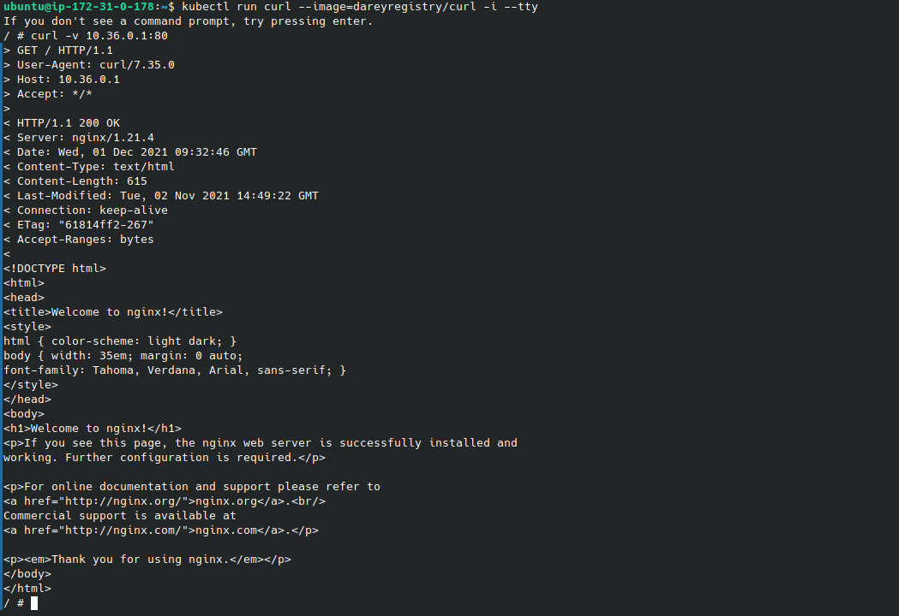
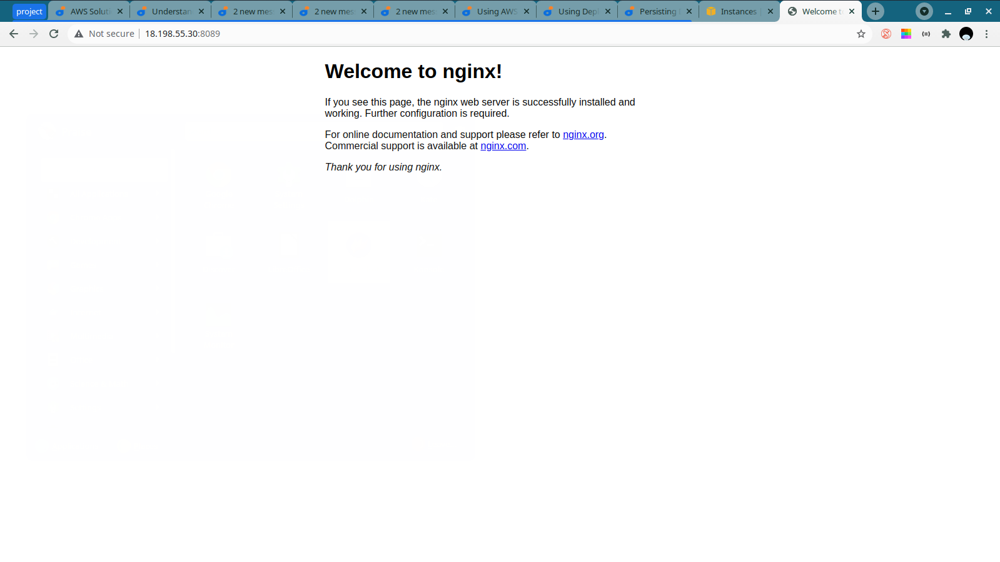
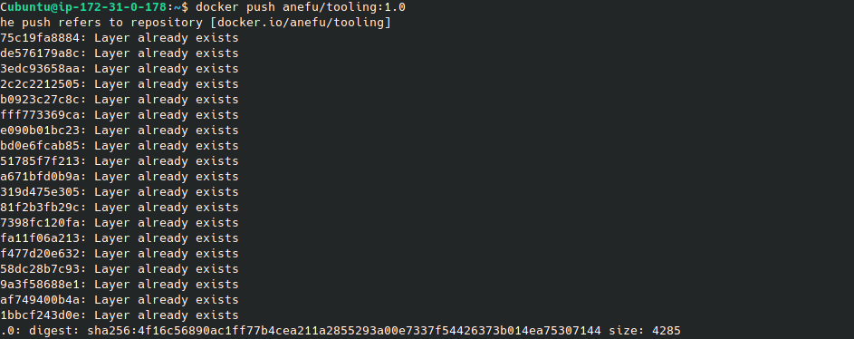
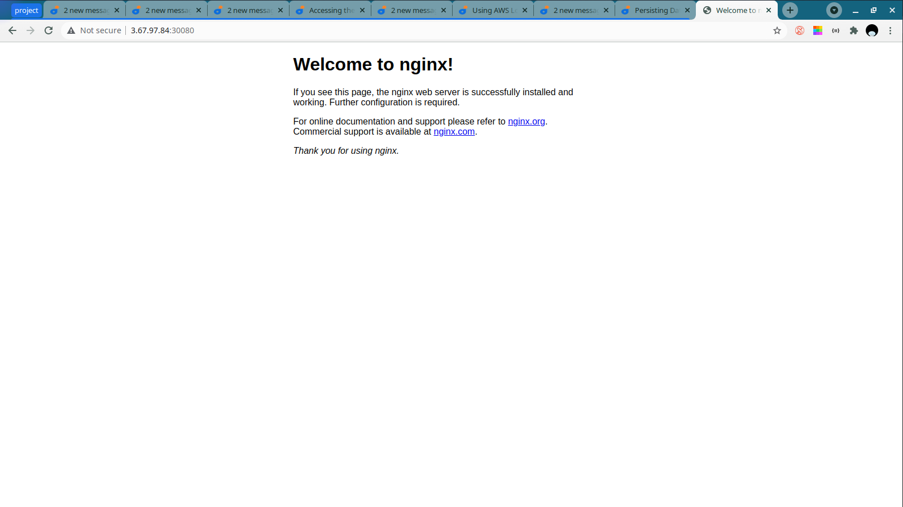
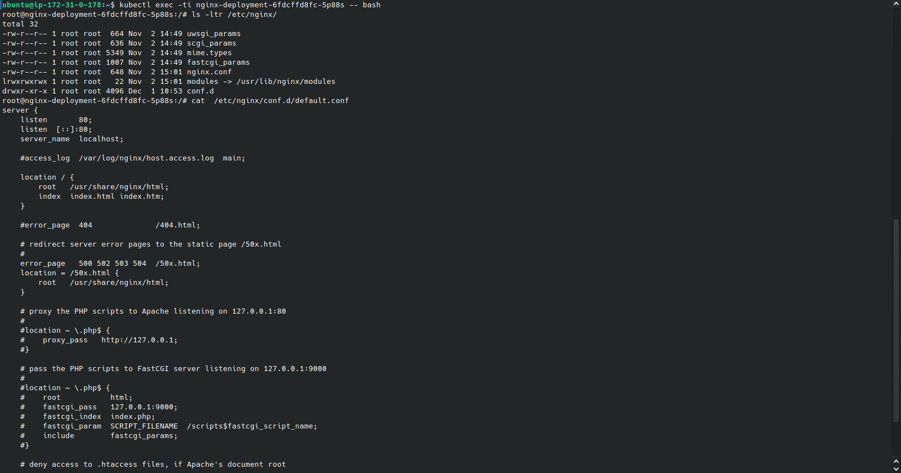
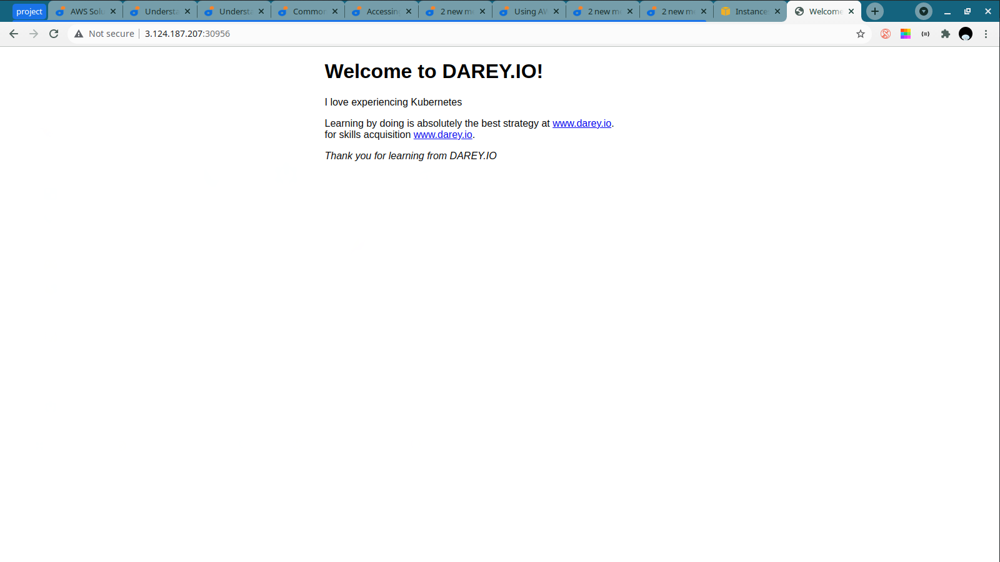

# Deploying Applications into Kubernetes Cluster

## Common Kubernetes objects
- Create an NGINX pod manifest
  ```yaml
    apiVersion: v1
    kind: Pod
    metadata:
      name: nginx-pod
    spec:
      containers:
      - image: nginx:latest
        name: nginx-pod
        ports:
        - containerPort: 80
            protocol: TCP
  ```
- Apply the manifest
  ```
  kubectl apply -f pod.yaml
  ```
  
Fields:
  - apiVersion: Which version of the Kubernetes API you're using to create this object
  - kind: Kind of object to create
  - metadata: Data that helps uniquely identify the object
  - spec: Contains further information about the Pod. Where to find the image to run the container – (this defaults to Docker Hub), the port and protocol

## Accessing the app from the browser
- Access the pod through its IP from within the K8s cluster
  ```
  kubectl run curl --image=dareyregistry/curl -i --tty
  ```
  ```
  curl -v 172.50.202.214:80
  ```
  
- Create a service to access to Nginx pod
  ```yaml
    apiVersion: v1
    kind: Service
    metadata:
      name: nginx-service
    spec:
      selector:
        app: nginx-pod 
      ports:
        - protocol: TCP
          port: 80
          targetPort: 80
  ```
  ```
  kubectl apply -f nginx-service.yaml
  ```
- Update the pod manifest to include the `labels` metadata
  ```yaml
  apiVersion: v1
    kind: Pod
    metadata:
        name: nginx-pod
        labels:
            app: nginx-pod  
    spec:
        containers:
        - image: nginx:latest
          name: nginx-pod
          ports:
            - containerPort: 80
              protocol: TCP
  ```
  `kubectl apply -f nginx-pod.yaml`
- Use port forwarding to attach port 8089 on the node to port 80 on the service
  ```
  kubectl  port-forward svc/nginx-service 8089:80
  ```
  

## Self Side Task


- Build the Tooling app Dockerfile and push it to Dockerhub registry
  
- Write a Pod and a Service manifests, ensure that you can access the Tooling app’s frontend using port-forwarding feature.
  - [tooling manifest](tooling.yaml)
    
    
  - [db manifest](db.yaml)


## Expose services using NodePort
```yaml
apiVersion: v1
kind: Service
metadata:
  name: nginx-service
spec:
  type: NodePort
  selector:
    app: nginx-pod
  ports:
    - protocol: TCP
      port: 80
      nodePort: 30080
```

## Create a ReplicaSet
- Create rs.yaml
  ```yaml
    apiVersion: apps/v1
    kind: ReplicaSet
    metadata:
      name: nginx-rs
    spec:
      replicas: 3
      selector:
          app: nginx-pod
      template:
          metadata:
              name: nginx-pod
              labels:
              app: nginx-pod
          spec:
          containers:
          - image: nginx:latest
              name: nginx-pod
              ports:
              - containerPort: 80
                protocol: TCP
  ```
  `kubectl apply -f rs.yaml`
- Scale the replicaset
  ```
  kubectl scale rs nginx-rs --replicas=5
  ```
  

## Using Deployments
- Create deployment.yaml file
  ```yaml
    apiVersion: apps/v1
    kind: Deployment
    metadata:
      name: nginx-deployment
      labels:
        tier: frontend
    spec:
      replicas: 3
      selector:
        matchLabels:
        tier: frontend
      template:
        metadata:
          labels:
            tier: frontend
        spec:
          containers:
          - name: nginx
            image: nginx:latest
            ports:
            - containerPort: 80
  ```
- Scale the deployment to 15 pods
  
- List the nginx files in one of the pods
  ```
  kubectl exec -it <pod-name> bash
  ```
  ```
  ls -ltr /etc/nginx/
  ```
  ```
  cat  /etc/nginx/conf.d/default.conf 
  ```
  

## Persisting Data for Pods
- Scale down nginx deployment to 1 replica
- Exec into the container and install vim
- Update the content of the file and add the code below /usr/share/nginx/html/index.html
  ```html
  <!DOCTYPE html>
    <html>
    <head>
    <title>Welcome to DAREY.IO!</title>
    <style>
        body {
            width: 35em;
            margin: 0 auto;
            font-family: Tahoma, Verdana, Arial, sans-serif;
        }
    </style>
    </head>
    <body>
    <h1>Welcome to DAREY.IO!</h1>
    <p>I love experiencing Kubernetes</p>

    <p>Learning by doing is absolutely the best strategy at 
    <a href="https://darey.io/">www.darey.io</a>.<br/>
    for skills acquisition
    <a href="https://darey.io/">www.darey.io</a>.</p>

    <p><em>Thank you for learning from DAREY.IO</em></p>
    </body>
    </html>
  ```
- Check the browser
  
